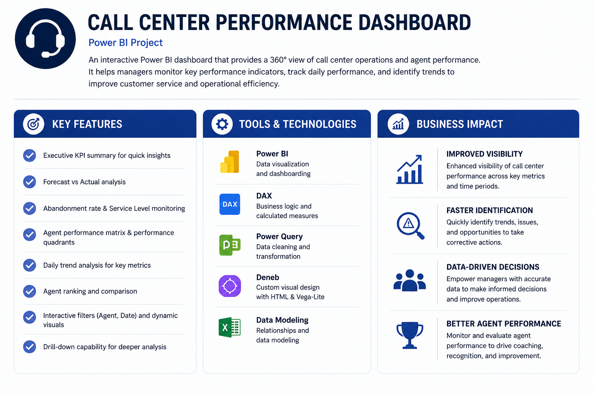
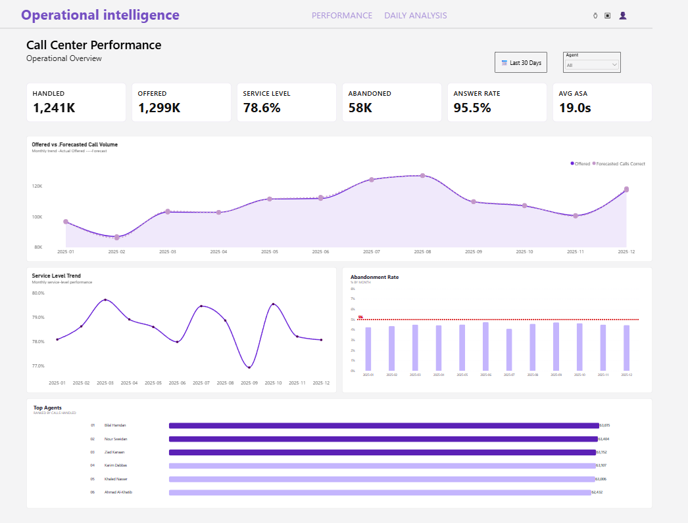
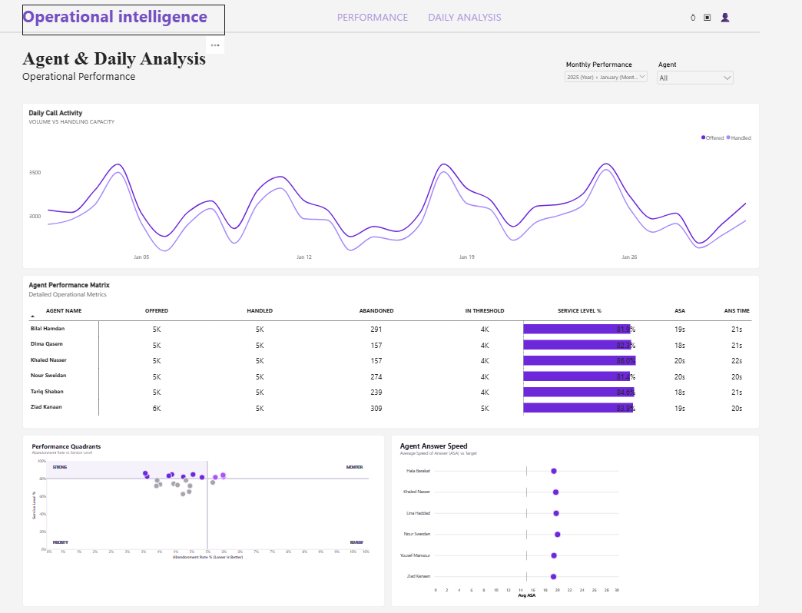

# 📊 Call Center Performance Dashboard

An interactive **Power BI Business Intelligence solution** designed to analyze call center operations, agent performance, service levels, abandonment, answer speed, and forecast accuracy.

> **Portfolio project:** built to demonstrate practical skills in data modeling, DAX, Power Query, KPI reporting, and interactive data visualization.

---

## 📌 Project Overview

This project transforms structured call center operational data into an interactive analytics solution for monitoring performance and identifying operational gaps.

The dashboard is organized into two analytical pages:

- **Performance Overview** — executive-level view of the main operational KPIs and agent performance.
- **Daily & Agent Analysis** — deeper analysis of daily call activity, agent effectiveness, answer speed, and operational indicators.

The Power BI model uses a dedicated `DateTable` for date filtering and time-based analysis, including previous-month and month-over-month calculations.

---

## 🖼️ Project Overview



---

## 📷 Dashboard Preview

### Performance Overview



### Daily Analysis



---

## 🎯 Business Objectives

- Monitor overall call center performance
- Evaluate individual agent performance
- Track Service Level and Abandonment Rate
- Analyze daily call activity and demand
- Compare Average Speed of Answer (ASA) against target
- Identify performance gaps and agents requiring attention
- Support data-driven operational decisions

---

## ⭐ Key Features

- Interactive date-based filtering
- Agent filtering and performance analysis
- KPI-driven operational monitoring
- Performance Overview page
- Daily & Agent Analysis page
- Agent Performance Matrix
- Performance Quadrants
- Daily Call Activity analysis
- Agent Answer Speed vs. Target
- Service Level and Abandonment Rate analysis
- Forecast vs. Actual call volume analysis
- Previous-month and MoM performance indicators
- Interactive page navigation

---

## 📈 Key KPIs

| KPI | Purpose |
|---|---|
| **Calls Offered** | Measures incoming call demand |
| **Calls Handled** | Measures successfully handled calls |
| **Calls Abandoned** | Tracks calls abandoned before handling |
| **Service Level %** | Measures calls handled within the defined threshold |
| **Abandonment Rate %** | Measures the share of calls that were abandoned |
| **Average Speed of Answer (ASA)** | Measures average time before a call is answered |
| **Answer Rate %** | Measures the proportion of offered calls that were handled |
| **Forecast Variance %** | Compares actual call volume with forecasted demand |

---

## 🛠️ Tools & Technologies

- **Microsoft Power BI**
- **DAX**
- **Power Query**
- **Data Modeling**
- **Microsoft Excel**
- **Deneb / Vega-Lite**
- **Data Visualization**

---

## 🧮 DAX & Data Modeling

The project includes reusable DAX measures for core KPIs, previous-month comparisons, month-over-month analysis, forecasting, agent ranking, display formatting, and custom visual support.

Examples include:

- Core KPI measures such as `Offered`, `Handled`, `Abandoned`, `Service Level %`, and `Avg ASA`
- Previous Month and MoM calculations
- Forecast variance calculations
- Agent ranking using `RANKX`
- Context-aware display measures
- HTML-based KPI card measures

The complete extracted measure set is available in **[`DAX_Measures.dax`](DAX_Measures.dax)**.

---

## 🔄 Data Preparation

Data preparation was performed using **Power Query** and Power BI data modeling techniques. The model uses a dedicated date dimension to support consistent date filtering, monthly analysis, and time-intelligence calculations.

The analytical grain remains at the operational record level while visuals aggregate the data to daily, monthly, and agent-level views as required.

More information about the dataset and modeling approach is available in **[`Data/README.md`](Data/README.md)**.

---

## 💡 Business Impact

The solution provides a centralized view of call center operations that can help managers:

- Identify service-level gaps
- Monitor abandonment behavior
- Compare agent performance
- Detect changes in call demand
- Evaluate answer-speed performance against target
- Compare forecasted demand with actual activity
- Support workforce planning and performance management

The goal is to turn operational call data into **clear, actionable business insights**.

---

## 📂 Repository Structure

```text
call-center-performance-dashboard/
│
├── README.md
├── Project_Overview.png
├── Performance_Overview.png
├── Daily_Analysis.png
├── Call_Center_Performance_Dashboard.pbix
├── DAX_Measures.dax
│
└── Data/
    └── README.md
```

---

## 👤 Author

**Omar Al-Dahleh**  
Management Information Systems (MIS) Graduate | Junior Data Analyst

**Focus:** Data Analysis • Business Intelligence • Power BI • DAX • Data Visualization
